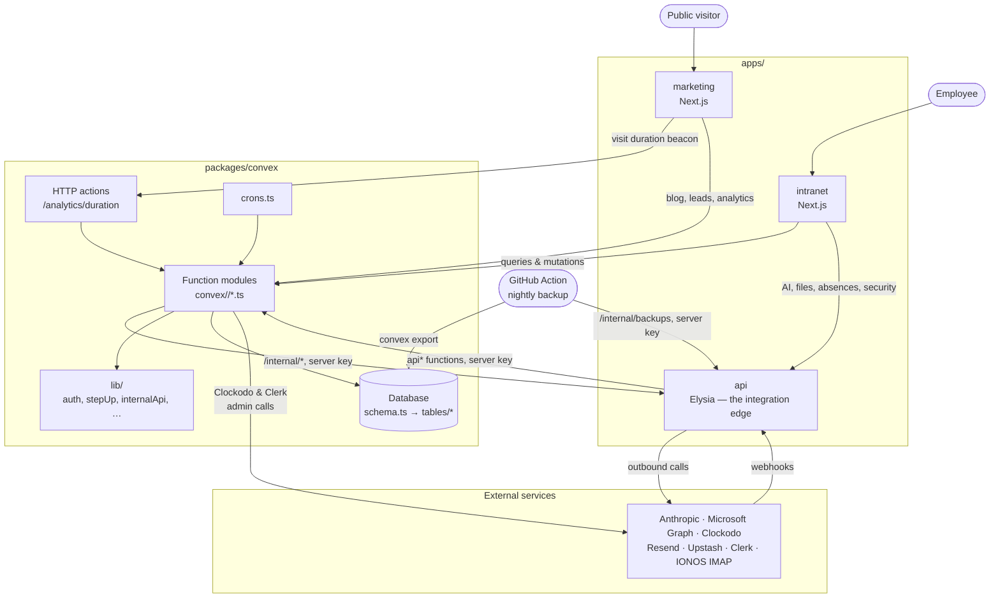

# Architecture overview

Hand-checked against the code — update it when an arrow below stops being
true. Generated diagrams (gitdiagram etc.) guess, and get the Clockodo paths
wrong.

## Who talks to whom

- **Browser → Convex directly.** Most intranet reads and writes are Convex
  queries/mutations authenticated by the Clerk JWT, gated by the builders in
  `functions.ts` (`userQuery({ role, can })`, `ctx.caller`).
- **Browser → apps/api.** Anything that needs a secret Convex can't or
  shouldn't hold: AI (Anthropic), OneDrive (Graph), Clockodo absences and
  clock entries, passkeys/TOTP/step-up, the applicant vault, Performance
  uploads, the read-only IONOS mailbox (IMAP). apps/api resolves the Clerk session, then calls Convex's `api*`
  functions with `CONVEX_SERVER_KEY` (checked by `assertServerKey`).
- **Convex → apps/api.** The other direction, via `lib/internalApi.ts`:
  transactional and broadcast email (apps/api owns Resend), OneDrive
  subscription renewal, the two-minute IONOS inbox poll.
- **Webhooks land on apps/api** (Clerk, Graph, Resend)
  and are relayed into Convex with the server key. Clerk, Resend and Graph
  deliveries are also recorded in `integrationHealth` for the admin panel.
- **Convex → Clerk** for invites (inline, so the admin sees a rejection) and
  for lock, unlock, delete and rename (scheduled from the mutation and
  retried; `people/clerkSync.ts`).
- **Nightly backup.** A GitHub Action exports production, encrypts it and
  uploads it to OneDrive through an upload session apps/api opens; the
  OneDrive credentials never leave apps/api. See `docs/backups.md`.
- **Clerk** signs users into all three apps; Convex trusts its JWT and
  apps/api verifies the session itself.
- **Marketing** also has its own pp/api routes that mail contact and
  whitepaper requests through Resend directly.
- **Absences are never mirrored.** apps/api fetches them live from
  Clockodo on every read (cached briefly in Upstash).
- **Mail is never mirrored either.** `mailAccounts` holds only the IONOS
  address, the password encrypted by apps/api (`MAIL_ENC_KEY`) and where the
  inbox stood at the last poll; apps/api reads messages live over IMAP
  (EXAMINE + BODY.PEEK, so nothing in the mailbox changes).

## Where code lives

| Layer | Path | Notes |
| --- | --- | --- |
| Intranet UI | `apps/intranet/src` | `app/` routes, `components/` by feature, `components/ui` shared primitives, `lib/` client helpers |
| Marketing | `apps/marketing/src` | public site; `app/api/[[...slugs]]` for its own form endpoints |
| Integration edge | `apps/api/src` | `routes/` public, `routes/internal/` Convex-only, `routes/webhooks/`; `lib/` one client per provider |
| Backend functions | `packages/convex/convex/<feature>/*.ts` | feature folders (`academy/`, `performance/`, `security/`, …) — each path is its `api.*` name; builders come from `functions.ts`. Root keeps single-module features (`chat.ts`, `files.ts`, …) plus shims for moved paths |
| Backend helpers | `packages/convex/convex/lib/`, `<feature>/lib/` | root `lib/` for cross-feature helpers (auth, step-up, validators), `<feature>/lib/` for one feature's — no Convex functions in either |
| Schema | `packages/convex/convex/schema.ts` + `tables/` | tables grouped by area; validators in `lib/validators.ts` |
| Shared types | `packages/types`, `packages/api-contract` | apps/api may only `import type` from these (no runtime load on Vercel) |
